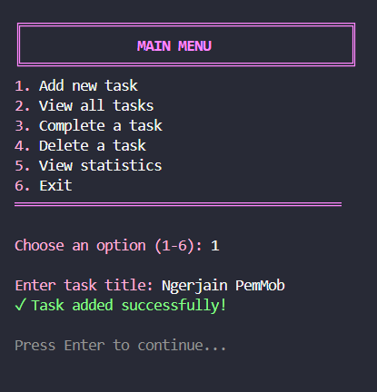

# 💕 Todo List - Dart PemMob

<div align="center">
  
</div>

Bikin todo list pinkie hmmzz

---

## 🎓 Identitasku ada di sinii

- **Nama**: Khonsaa Hilmi Mufiida
- **NIM**: HID023069
- **Shift KRS**: A
- **Shift Baru**: D

---

## ✨ Fitur-Fitur nya kakaa

- ➕ **Add new tasks** - Bikin task baru, title nya bebas
- 📋 **View all tasks** - Bisa lihat semua task yang dah dibuat tadi, kalau dah kelar nanti ada tanda centang dan warna teks nya abu2
- ✅ **Complete tasks** - Kalau dah selesai ngerjain task nya bisa di centang
- 🗑️ **Delete tasks** - Ni kalau mau hapus task karena dah ngga dibutuhin/ngga jadi ngerjain,etc.
- 📊 **View statistics** - Buat liat semua task yang ada (jumlah semuanya, yang udah selesai, dan yang masih nganggur)
- 💾 **Persistent storage** - Langsung kesimpen otomatis di JSON file
- 🎨 **Pink theme** - Biar lucu girlie eak 💅🏻

---

## 🎨 Screenshots

### 1. Main Menu


Di tampilan awal ini ada 6 main menu yang bisa dipilih

---

### 2. Add New Task


Pilih angka 1 untuk Add new task, setelah itu masukkan title task yang di mau, setelah itu klik enter, nanti langsung task yang tadi barusan dibuat akan tersimpan. 1inggal isi pakai angka '1'

---



Pilih angka 1 untuk Add new task, setelah itu masukkan title task yang di mau, setelah itu klik enter, nanti langsung task yang tadi barusan dibuat akan tersimpan. (sama kayak nambahin yang pertama dan begitu seterusnya). Tinggal isi pakai angka '1'

---

### 3. View All Tasks


Untuk lihat semua task yang ada/yang udah dibuat tadi. Task yang udah selesai akan ditandai dengan ☑ dan warnanya akan jadi abu-abu, tinggal isi pakai angka '2'

---

### 4. Complete a Task


Bisa nandain task dengan sudah selesai/sudah dikerjakan dengan cara pilih task mana yang mau ditandain dah kelar pakai angka sesuai urutan task yang tertera di tampilannya yaw. Tinggal isi pakai angka '3'

---

### 5. Delete a Task


Hapus task kalau semisal dah ngga kepakai/ngga jadi dikerjain/malas,etc. tinggal isi pakai angka '4'

---

### 6. View Statistics


Ni kalau mau lihat task apa aja yang ada (totalnya), yang udah dikerjain dan yang belum dikerjain yaw, tinggal isi pakai angka '5'

---

### 7. Exit Program


Ini kalau udah kelar dan semisal mau udahan aja, nanti ada kalimat surprise 🤭, tinggal isi pakai angka '6'

---

## 📚 Penjelasan Kode

### 1. Class Structure

#### Colors Class
```dart
class Colors {
  static const String pink = '\x1B[38;5;213m';
  static const String green = '\x1B[38;5;120m';
  // ... styling constants
}
```
Ini untuk nyimpen ANSI color codes buat terminal styling nya biar pinkeu

#### Task Class
```dart
class Task {
  String title;
  bool isCompleted;
  DateTime createdAt;
  
  Map<String, dynamic> toJson() { ... }
  factory Task.fromJson(Map<String, dynamic> json) { ... }
}
```
Model class yang menggambarkan satu task dengan fitur JSON serialization untuk menyimpan dan membaca data

#### TodoListManager Class
```dart
class TodoListManager {
  List<Task> tasks = [];
  
  Future<void> loadTasks() async { ... }
  Future<void> saveTasks() async { ... }
  void addTask(String title) { ... }
  void completeTask(int index) { ... }
  void deleteTask(int index) { ... }
  void displayTasks() { ... }
  void displayStats() { ... }
}
```
Untuk ngelola semua operasi todo list termasuk CRUD (Create, Read, Update, Delete) dan penyimpanan data ke file

---

### 2. Key Features Implementation

#### Auto-Save Feature
Setiap perubahan akan otomatis tersimpan ke file `tasks.json`:
```dart
void addTask(String title) {
  tasks.add(Task(title: title));
  saveTasks();
  print('✓ Task added successfully!');
}
```

#### Persistent Storage
Menggunakan operasi file asynchronous untuk menyimpan data:
```dart
Future<void> saveTasks() async {
  final file = File(filePath);
  final jsonData = tasks.map((task) => task.toJson()).toList();
  await file.writeAsString(json.encode(jsonData));
}
```

#### Input Validation
Mencegah error dari input user yang tidak valid:
```dart
final index = int.tryParse(input ?? '');
if (index != null && index > 0 && index <= tasks.length) {
} else {
  print('Invalid input!');
}
```
Menggunakan `int.tryParse()` untuk memastikan input nya berupa angka yang valid dan berada dalam range yang benar (1-6 doang)

---

## 📂 Project Structure
```
todolist_h1d023069/
│
├── bin/
│   └── todolist_h1d023069.dart    # File uatama nya
│
├── assets/                         # Folder untuk ss an
│   ├── welcome.png
│   ├── menu.png
│   ├── add_new_task.png
│   ├── view_tasks.png
│   ├── complete_task.png
│   ├── delete_task.png
│   ├── statistics.png
│   └── exit.png
│
├── tasks.json                      # Auto-generated task storage
├── .gitignore                      # Git ignore file
└── README.md                       # Documentation
```

---

<div align="center">
  
### PemMob Dart

**⭐🩷 Todo list pinkeu 🩷⭐**

</div>
